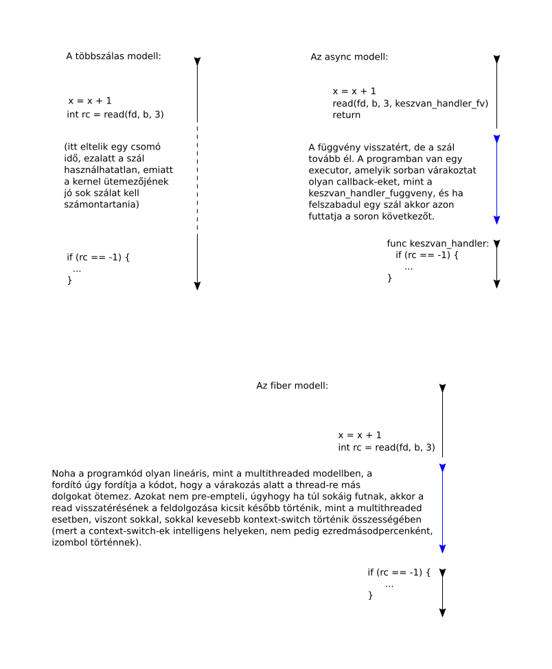

# 2 - Callback függvények

A Javascript végrehajtók jellemzően egyszálasak. Ez könnyebbé teszi a
kódolást, mert kevesebb szinkronizációs primitívre van szükség, viszont
drágává tesz minden olyan műveletet, ahol várni kell arra, hogy az
operendszer csináljon valamit.

Erre a problémára több különböző megoldás létezik:



A Go a fiber modellt használja, az talán a legmodernebb, más
nyelveken is megjelenik, noha azokon a nyelveken, amelyek korábban
keletkeztek, inkább opcionális libraryként, nem pedig a nyelv szerves
részeként.

A Javascriptes világban az async modell terjedt el. A NodeJS API-jában
sok függvény van, aminek van Async és Sync változata is. A kettő
között az a különbség, hogy az előbbi azonnal visszatér, csak
kér egy callback-et, és ha elvégezte a feladatot, majd azt meghívja
az eredménnyel.

Javascript-ben ezeken a módokon lehet callback-eket készíteni:

```javascript
function foo1() {
  const n = 3;
  const cb1 = function(a, b) { return a + b + n; }
}

function x(a, b) {return a, b}; // ez valahol korábban van

function foo2() {
  const cb2 = x;
}

function foo3() {
  const n = 3;
  const cb3 = (a, b) => {return a+b+n;}
}
```

A harmadik az új, az ES6-ban jelent meg, és nem csak egy syntactic
sugar.

Az 1. és a 3. példában az `n` változó capture-ölve van, azaz egy
referencia készül róla a closure készülésének a pillanatában, és
a closure-ön belül használható.

Akkor is használható, ha a closure futásának pillanatában az eredeti
változó már rég nem él. Tehát pl. ha a `foo1` vagy a `foo3` visszaadja
a `cb1`-et illetve a `cb3`-at a hívónak, akkor a visszaadás pillanatában
a saját változói deallokálódnak --- kivéve azok, amelyekre őrződött meg
referencia. Azok tovább élnek a függvény befejeződése után is.

Fontos nagyon: nem érték capture-ölődik, hanem referencia az eredetire.
Ez C++-ban nem így van, ott a lokális változók deallokálódnak a
függvény visszatérésekor.

No de mégis, mi a lényegi különbség az 1. és a 3. között? Az, hogy
hogyan kap értéket a "this". Ez egy iszonyú bonyolult téma, amit majd
másor írok le, ide elég annyi, hogy a Javascript-ben a this egy
mágikus változó. Úgy kell elképzelni, hogy egy függvény elindulásakor
a this kap valami értéket --- hogy mit, az attól függ, hogy hogyan
lett elindítva, és jellemzően valami objektumorientációhoz használjuk,
azaz a this valamiféle objektumpéldány referenciája lesz.

De lehet bármi, a nyelv nem rögzíti. Lehet (speciális szintaktikával)
úgy meghívni egy függvényt, hogy a this értéke mondjuk épp a 3 szám
legyen.

Lehet továbbá egy értéket hozzáragasztani egy függvényhez, bind-olni,
úgy, hogy ha külön nincs specifikálva, akkor az legyen a this értéke
ha meghívják a függvényt. Ha egy függvényhez nincs semmi bind-olva,
akkor ha meghívják, akkor valami automatika kitalálja, hogy mi legyen.

Ez az automatika történetileg rettenetesen idiótára sikerült, amit nagyon,
nagyon bánnak már a nyelv eredeti tervezői, de nem volt kiút, eddig.
Ugyanis legtöbbször a globális "window" objektum lett a this értéke,
ha az nem volt specifikálva.

Ezért a closure-készítés tipikus formája ez volt:

```
cb = valami_mar_letezo_fuggveny.bind(this)
```

Így lehetett megoldani, hogy egy objektum-metódusban készített closure
(merthogy objektumok vannak, csak még nem mutattam a szintaxist) az a
futása alatt ugyanazt a this-t lássa, mint ahol a closure-t
elkészítettük.

Na ez az, amit a `(paraméterek) => { kód }` szintaktika defaultból
így csinál: az így készített closurehöz automatikusan bind-olva van
az a this, ami épp volt ahol készült a closure.

Amióta ez a szintaktika létezik, azóta a styleguide-okban a
`const cb = function(paraméterek) {kód}` szintaktika simán be van
tiltva, mert lényegében nincs alkalom, hogy tényleg azt gondolnád.

## 1. Feladat: Javascript+NodeJS Async API-val

Írd át a következő NodeJS snippet-et úgy, hogy az async Node API-t
használja:

```javascript
const process = require('process');
const fs = require('fs');

function titkosit(num) {
    if (num < 65 || num > 122) return num;
    return ((num - 65) + 1) % 57 + 65;
}

const fd = fs.openSync(process.argv[2], 'r');

while (true) {
    const buf = new Uint8Array(1);
    const bytesRead = fs.readSync(fd, buf, 0, 1, null);
    if (bytesRead <= 0) {
		break;
    }
    const t = titkosit(buf[0]);
    const outBuf = Buffer.from([t]);
    process.stdout.write(outBuf.toString('binary'));
}
```

Csak az `openSync` helyett kell `open`-t, és a `readSync` helyett
`read`-et használni, a `titkosit` függvény maradhat a jelenlegi
sync megoldás. Kérdés: miért? Azaz, pontosabban: ha
már megkínlódunk a többi átírásával, miért nem írjuk át ezt is,
ha azokat érdemes átírni, ezt miért nem?

A kód elég jelentősen máshogy fog kinézni, lehet, hogy használsz
függvényt vagy függvényeket.

A NodeJs releváns API-ja itt található:
https://nodejs.org/api/fs.html

Használom a kódban a `process` modult is. Abban az egyetlen érdekesség:
azért `argv[2]`, mert a 0. az maga az interpreter, az 1. a javascript
fájl neve, így a 2. lesz az első igazi paraméter.

Ha készen van, akkor mindnféle fordítás nélkül a
```
node titkosit-sync.js titkosit-sync.js
```
paranccsal tudnod kell futtatni. Ehhez nem kell semmiféle `npm` installt
futtatni.

## 2. Feladat: Typescript + NodeJS, Sync API

Ehhez nyiss egy könyvtárat, és abban inicializáld a Typescript-et:
```
npm i typescript --save-dev
```

A `--save-dev` azt jelenti, hogy csak development dependencia lesz belőle.
Nézz bele a `package.json`-ba, odatette. Létrehozott továbbá egy `node_modules/`
könyvtárat is, abban is benne van.

Ha tiszta lapot akarsz, akkor kitörölheted a `node_modules/` könyvtárat, egy
sima, egyéb paraméterek nélküli `npm install` mindent visszatesz bele a
`packages.json` alapján.

Ahhoz, hogy Typescript kódból tudjuk a NodeJS API-ját használni, a Typescript
compilernek szüksége van a NodeJS moduljainak a típusdeklarációira. Ehhez
a `@types/node` csomagot kell feltennünk:
```
npm i @types/node
```

Nézz bele a `node_modules/@types/node/index.d.ts` fájlba. Keresd ki az `fs`
modul deklarációját, csak érdekességképpen. Ezt a fájlt egyébként nem kell
sehogy include-olnod, a Typescript compiler automatikusan include-ol
mindent a `@types`-ból.

Olvass el valamennyit a Typescript dokumentációjának az Modulokról szóló
fejezetének az
[import-okról szóló részéből](https://www.typescriptlang.org/docs/handbook/modules.html)!

Látod majd, hogy többféle módon is lehet importálni, lehet a teljes `'fs'` modult,
vagy csak bizonyos dolgokat belőle. Az

```typescript
import {openSync, readSync} from 'fs';
```

szintaktikának például működnie kell. Kísérletezhetsz másokkal is.

A `titkosit` függvény deklarációjához típusokat kell tudnod adni.
Nézz bele a Typescript dokumentációjának [függvényekről szóló részébe](https://www.typescriptlang.org/docs/handbook/functions.html),
viszonylag az elején ott van, hogy hogyan kell.

Fontos, hogy a belinkelt doksikból annyit olvass csak, amennyire
szükséged van itt a feladat megoldásához (illetve olvashatsz többet is,
de csak ha az nem veszélyezteti a feladat megoldását).

A `titkosit` függvény `number` típust eszik, és `number`-t ad vissza,
a Typescript-ben is csak az van, nincs egész szám típus.

A `titkosit`-on kívül mást nem kell neked annotálni, minden mást a
Typescript compiler kitalál a kontextusból.

Szükséged van egy `tsconfig.json`-ra. Ennek két fontos eleme van,
meg kell mondani a Typescript compilernek, hogy NodeJS-es modult
fordítson (ezt `commonjs`-nek hívják), és hogy ne nézzen alá a
`node_modules/` könyvtárnak:

```json
{
    "compilerOptions": {
        "target": "ES6",
        "module": "commonjs"
    },
    "exclude": [
        "node_modules"
    ]
}
```

Ha megírtad a `titkosit-sync.ts` programodat, ebben a könyvtárban, akkor
a `./node_modules/.bin/tsc` parancsot kiadva tudod fordítani (paraméterek
nélkül, defaultból minden `.ts` fájlt fordít).

Az eredménynek a `.ts` fájl mellett kell megjelennie, `.js` kiterjesztéssel,
és a `node titkosit-sync.js titkosit-sync.js` parancsnak működnie kell.

## 3. Feladat: Typescript + NodeJS, ASync API

Végül pedig írd meg Typescript-ben azt a megoldást, ami a NodeJS ASynd API-ját
használja.

Szükséged lesz néha arra, hogy a NodeJS függvényeinek a típusait tudd.
Ehhez nyisd meg a `node_modules/@types/node/index.d.ts` fájlt valamilyen
nézegetővel, és abban keresd ki. Ha például azt szeretnénk tudni, hogy
az `fs.open` callback-je Typescript-ben milyen típusú, akkor kikeressük
benne a `declare module "fs"` részt, abban az `open` típusdefinícióját,
és ezt látjuk:

```typescript
/**
     * Asynchronous open(2) - open and possibly create a file. If the file is created, its mode will be `0o666`.
     * @param path A path to a file. If a URL is provided, it must use the `file:` protocol.
     */
    export function open(path: PathLike, flags: string | number, callback: (err: NodeJS.ErrnoException, fd: number) => void): void;
```

Látszik hát, hogy ha nem inline callback-et írunk, hanem szépen valahol függvényként,
akkor annak így kell kinéznie:

```typescript
function openDone(err: NodeJS.ErrnoException, fd: number): void {
    ...
}
```

A lefordított `.js`-nek itt is a `.ts` mellett kell megjelennie, és
`node titkosit-async.js titkosit-async.js` paranccsak működnie.


