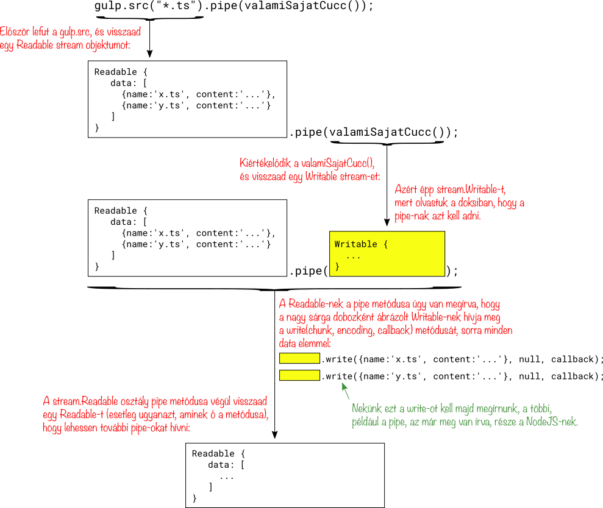
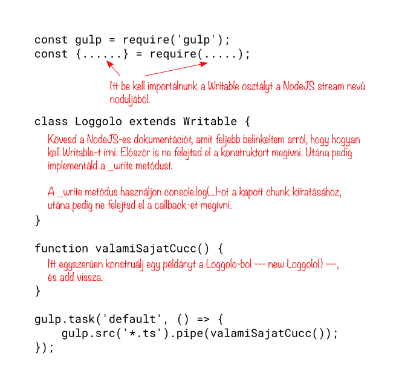

# 3 - Gulp, és NodeJS Stream-ek

A [Gulp](https://github.com/gulpjs/gulp/blob/master/docs/API.md) egy
igazán elterjedt program, amit nagyjából a `make` helyett használnak.
Ebben a fejezetben játszunk egy kicsit a Gulp-pal, mégpedig azért,
mert kulcsfontosságú a megértése ahhoz, hogy egy ismeretlen kódot
látva megértsük, hogyan vannak benne összedrótozva a komponensek.

A Gulp fent linkelt dokumentációja egy nagyon szuggesztív kóddal
indul:

```javascript
gulp.src('client/templates/*.pug')
  .pipe(pug())
  .pipe(minify())
  .pipe(gulp.dest('build/minified_templates'));
```

Valamit csinál az `gulp.src`, és valahogy belepipe-olja az eredményt
a `pug()`-ba, de mit pipe-ol bele, és miféle dolog az a `pug()`??

A dokumentáció elvileg segít, de valójában eléggé elküld az erdőbe,
mind a három link sok estés olvasmány:

> Returns a [stream](http://nodejs.org/api/stream.html) of [Vinyl files](https://github.com/gulpjs/vinyl-fs)
> that can be [piped](http://nodejs.org/api/stream.html#stream_readable_pipe_destination_options)
> to plugins.

Az első feladat, amit kitűzünk magunknak: próbáljuk ki, mit is
pipe-ol a Gulp nekünk? Azaz, valami ilyesmit szeretnénk írni:

```javascript
gulp.src('*.ts')
  .pipe(valamiSajatCucc())
```

A `valamiSajatCucc()`-ot először primitívre készítjük, simán csak
írja ki a képernyőre, hogy mit pipe-olt bele a `gulp.src`.

## A Gulp konfigurációs fájlja

A Gulp egy `gulpfile.js` nevű fájlt hajt végre amikor elindul, ezt kell
majd megírnunk.

A [dokumentáció](https://github.com/gulpjs/gulp/blob/master/docs/API.md)
szerint négy dolgot írhatunk bele, ezek:
`gulp.src`, `gulp.dest`, `gulp.task` és a `gulp.watch`.

Valójában a `gulpfile.js` egy sima Javascript fájl, bármi mást is
írhatunk bele, ami NodeJS-ben értelmes.

A tetejére kell egy sor, amivel betöltjük a `gulp` modult:

```javascript
const gulp = require('gulp');
```

Miután a Gulp lefuttatta a `gulpfile.js`-t, megnézi, hogy milyen task-ok
kerültek a memóriájába, és végrehajtja vagy a `default` nevűt, vagy ha
a felhasználó paraméterben másikat kért végrehajtani, akkor azt amit
a felhasználó kért.

A `gulp.task` meghívásával tudjuk majd elérni, hogy task-ok kerüljenek
a Gulp memóriájába. A fent belinkelt dokumentációból azt sejtjük, hogy
valami ilyesmit kell majd írnunk:

```javascript
const gulp = require('gulp');

function valamiSajatCucc() {
  ????
}

gulp.task('default', () => {
    gulp.src('*.ts')
        .pipe(valamiSajatCucc())
})
```

Mi az a `.pipe`, hogy kell érteni azt a `gulp.src`-s két sort? Leegyszerűsítve
valahogy így:


   
A valóságban ennél bonyolultabban működik, de nem sokkal. Kicsit kell is hogy bonyolultabb
legyen, mert azt is meg akarhatjuk oldani, hogy a pipe-nak beadott "valami" az képes
legyen átalakított, vagy akár más, újonnan gyártott objektumokat továbbadni.

## NodeJS Stream-ek

Nézzük csak a fenti Gulp-os dokumentációs mondatot mégegyszer:

> Returns a [stream](http://nodejs.org/api/stream.html) of [Vinyl files](https://github.com/gulpjs/vinyl-fs)
> that can be [piped](http://nodejs.org/api/stream.html#stream_readable_pipe_destination_options)
> to plugins.

A [stream](http://nodejs.org/api/stream.html) link egy NodeJS, és nem egy Gulp-os dokumentációs
oldalra visz.

Ne engedjünk a kisértésnek, ne olvassuk el az egészet, csak a `.pipe` dokumentációját keressük
meg: [readable.pipe(destination\[, options\])](https://nodejs.org/api/stream.html#stream_readable_pipe_destination_options).

Ezt azt mondja, hogy a `.pipe(...)` függvény az első paraméterébe valami `stream.Writable`-t kér. Írjunk hát egyet!

### 1. Feladat - kiíratni, hogy mit kap a `valamiSajatCucc()`.

Hozzunk létre egy könyvtárat, abban a szokásos `npm init`, majd `npm install gulp --save-dev`.
Ha a `./node_modules/.bin/gulp` parancsot futtatjuk, akkor a Gulpnak el kell indulnia,
és panaszkodnia kell, hogy nem találja a `gulpfile.js`-t.

Nyisd meg annak a leírását, hogy
[hogyan kell saját `Writable`-t implementálni](https://nodejs.org/api/stream.html#stream_implementing_a_writable_stream).

Találsz benne olyat, hogy

```javascript
const { Writable } = require('stream');
```

Ez egy ES6-os szintaktika, azt jelenti, hogy a `Writable` változó legyen egyenlő a `require(...)`
által visszaadott objektum `Writable` memberével. Ezt úgy hívják, hogy Destructuring Assignment,
és érdemes olvasni róla [az MDN-en](https://developer.mozilla.org/en-US/docs/Web/JavaScript/Reference/Operators/Destructuring_assignment).

A `gulpfile.js`-t valahogy így kell hát megírni:



Használhatod a dokumentációban ajánlott "Simplified Construction" módszert is,
azaz hogy származtatás nélkül egyszerűen csak konstruálsz egy példányt
a `Writable`-ből, és a konstruktornak beadsz egy objektumot aminek van `write` metódusa. Vigyázz,
ha származtatsz, akkor `_write`, ha az egyszerűsített módszert használod, akkor `write` (ennek semmi
mélyebb értelme nincs, úgy van megírva a NodeJS, hogy így kelljen csinálni, ez a "Simplified Construction"
nem valami általános Javascript-es trükk.).

Az egyszerűsített formátum valahogy így megy:

```javascript
function valamiSajatCucc() {
    return new Writable({
       midenfele: "ertek",
       write(chunk, encoding, callback) {
          ...
          callback();
       },
    }
}
```

A dokumentációból nem nyilvánvaló, de elég a `_write`-ot megírni, a `_writev`-t nem kötelező.

A doksiból látod, hogy a write-ot úgy kell írni, hogy három paramétert kapjon: a `chunk`,
ami maga az adat, ki tudja milyen típussal, valami `encoding`, meg egy `callback`. Ne
feledd a `callback`-et meghívni a végén:

```javascript
_write(chunk, encoding, callback) {
    ...
    callback();
}
```

Vedd észre továbbá, hogy az ES6-ban úgy készítünk osztálymetódusokat, hogy csak a nevüket
és a paramétereiket írjuk le, nem kell a `function`:

```javascript
class Valami extends MasikValami {
  constructor(esetleg parameterek) {
    super(esetleg parameterek);
  }
  
  valamilyenMetodus(parameterek) {
    ...
  }
}
```

A NodeJS Stream-ek defaultból string-eket stream-elnek, de a `gulp.src` objektumokat.
Ezért amikor a szülő konstruktorát hívod, akkor annak meg kell adni, hogy ez a
stream objektumokon működjön:

```javascript
class Loggolo extends Writable {
    constructor() {
      super({
        objectMode: true,
      });
    }

    ...ide jön a _writev
}
```

Készítsünk egy `x.ts` és egy `y.ts` nevű fájlt, hogy valamit találjon is a `gulp.src`:

```bash
echo alma > x.ts
echo korte > y.ts
```

Ha kész a program, akkor a `./node_modules/.bin/gulp` utasítással futtassuk. Valami ilyet
kell, hogy kapjunk:

```bash
~/progcourse/003-gulp/megoldas-01 % ./node_modules/.bin/gulp 
[23:15:23] Using gulpfile ~/progcourse/003-gulp/megoldas-01/gulpfile.js
[23:15:23] Starting 'default'...
[23:15:23] Finished 'default' after 4.2 ms
<File "x.ts" <Buffer 61 6c 6d 61 0a>>
<File "y.ts" <Buffer 6b 6f 72 74 65 0a>>
~/progcourse/003-gulp/megoldas-01 % 
```

Nézz bele nyugodtan a [megoldásba](003-gulp/megoldas-01), utána csukd be, és próbáld
újra, addig, amíg nem kapod a fenti eredményt.

## Debuggoláshoz alkalmas objektum-kiíratás a NodeJS-ben


