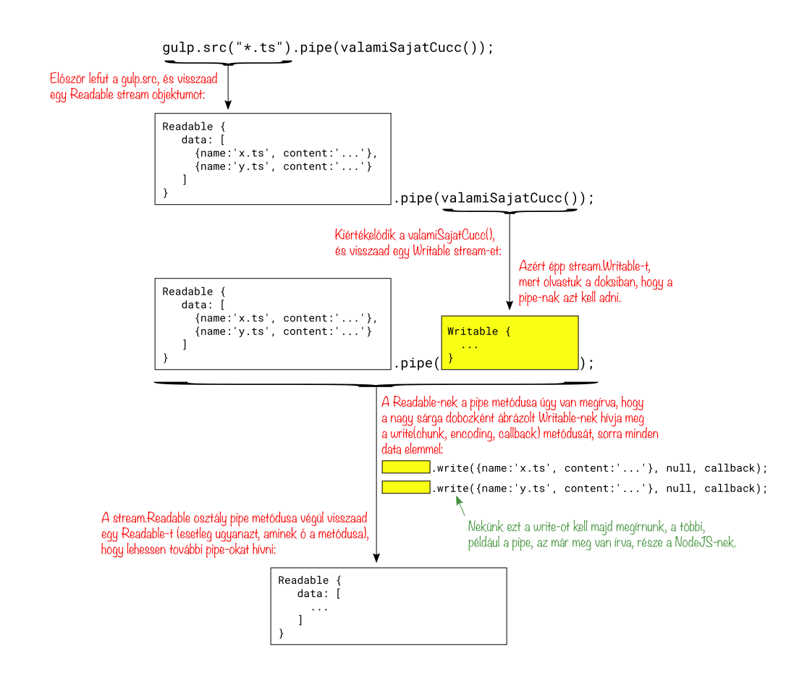
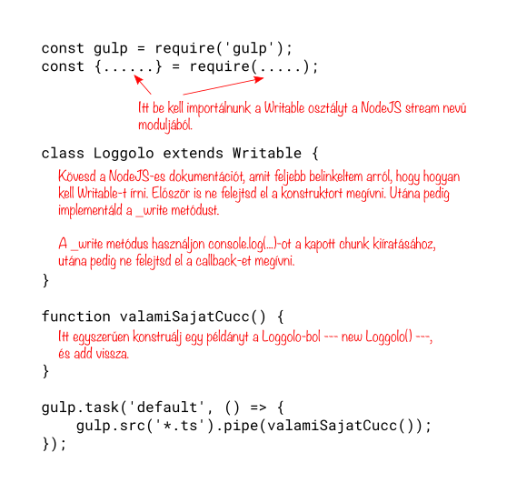

# 4 - Gulp, és NodeJS Stream-ek

A [Gulp](https://github.com/gulpjs/gulp/blob/master/docs/API.md) egy
igazán elterjedt program, amit nagyjából a `make` helyett használnak.
Ebben a fejezetben játszunk egy kicsit a Gulp-pal, mégpedig azért,
mert kulcsfontosságú a megértése ahhoz, hogy egy ismeretlen kódot
látva megértsük, hogyan vannak benne összedrótozva a komponensek.

A Gulp fent linkelt dokumentációja egy nagyon szuggesztív kóddal
indul:

```javascript
gulp.src('client/templates/*.pug')
  .pipe(pug())
  .pipe(minify())
  .pipe(gulp.dest('build/minified_templates'));
```

Valamit csinál az `gulp.src`, és valahogy belepipe-olja az eredményt
a `pug()`-ba, de mit pipe-ol bele, és miféle dolog az a `pug()`??

A dokumentáció elvileg segít, de valójában eléggé elküld az erdőbe,
mind a három link sok estés olvasmány:

> Returns a [stream](http://nodejs.org/api/stream.html) of [Vinyl files](https://github.com/gulpjs/vinyl-fs)
> that can be [piped](http://nodejs.org/api/stream.html#stream_readable_pipe_destination_options)
> to plugins.

Az első feladat, amit kitűzünk magunknak: próbáljuk ki, mit is
pipe-ol a Gulp nekünk? Azaz, valami ilyesmit szeretnénk írni:

```javascript
gulp.src('*.ts')
  .pipe(valamiSajatCucc())
```

A `valamiSajatCucc()`-ot először primitívre készítjük, simán csak
írja ki a képernyőre, hogy mit pipe-olt bele a `gulp.src`.

## A Gulp konfigurációs fájlja

A Gulp egy `gulpfile.js` nevű fájlt hajt végre amikor elindul, ezt kell
majd megírnunk.

A [dokumentáció](https://github.com/gulpjs/gulp/blob/master/docs/API.md)
szerint négy dolgot írhatunk bele, ezek:
`gulp.src`, `gulp.dest`, `gulp.task` és a `gulp.watch`.

Valójában a `gulpfile.js` egy sima Javascript fájl, bármi mást is
írhatunk bele, ami NodeJS-ben értelmes.

A tetejére kell egy sor, amivel betöltjük a `gulp` modult:

```javascript
const gulp = require('gulp');
```

Miután a Gulp lefuttatta a `gulpfile.js`-t, megnézi, hogy milyen task-ok
kerültek a memóriájába, és végrehajtja vagy a `default` nevűt, vagy ha
a felhasználó paraméterben másikat kért végrehajtani, akkor azt amit
a felhasználó kért.

A `gulp.task` meghívásával tudjuk majd elérni, hogy task-ok kerüljenek
a Gulp memóriájába. A fent belinkelt dokumentációból azt sejtjük, hogy
valami ilyesmit kell majd írnunk:

```javascript
const gulp = require('gulp');

function valamiSajatCucc() {
  ????
}

gulp.task('default', () => {
    gulp.src('*.ts')
        .pipe(valamiSajatCucc())
})
```

Mi az a `.pipe`, hogy kell érteni azt a `gulp.src`-s két sort? Leegyszerűsítve
valahogy így:


   
A valóságban ennél bonyolultabban működik, de nem sokkal. Kicsit kell is hogy bonyolultabb
legyen, mert azt is meg akarhatjuk oldani, hogy a pipe-nak beadott "valami" az képes
legyen átalakított, vagy akár más, újonnan gyártott objektumokat továbbadni.

## NodeJS Stream-ek

Nézzük csak a fenti Gulp-os dokumentációs mondatot mégegyszer:

> Returns a [stream](http://nodejs.org/api/stream.html) of [Vinyl files](https://github.com/gulpjs/vinyl-fs)
> that can be [piped](http://nodejs.org/api/stream.html#stream_readable_pipe_destination_options)
> to plugins.

A [stream](http://nodejs.org/api/stream.html) link egy NodeJS, és nem egy Gulp-os dokumentációs
oldalra visz.

Ne engedjünk a kisértésnek, ne olvassuk el az egészet, csak a `.pipe` dokumentációját keressük
meg: [readable.pipe(destination\[, options\])](https://nodejs.org/api/stream.html#stream_readable_pipe_destination_options).

Ezt azt mondja, hogy a `.pipe(...)` függvény az első paraméterébe valami `stream.Writable`-t kér. Írjunk hát egyet!

### 1. Feladat - kiíratni, hogy mit kap a `valamiSajatCucc()`.

Hozzunk létre egy könyvtárat, abban a szokásos `npm init`, majd `npm install gulp --save-dev`.
Ha a `./node_modules/.bin/gulp` parancsot futtatjuk, akkor a Gulpnak el kell indulnia,
és panaszkodnia kell, hogy nem találja a `gulpfile.js`-t.

Nyisd meg annak a leírását, hogy
[hogyan kell saját `Writable`-t implementálni](https://nodejs.org/api/stream.html#stream_implementing_a_writable_stream).

Találsz benne olyat, hogy

```javascript
const { Writable } = require('stream');
```

Ez egy ES6-os szintaktika, azt jelenti, hogy a `Writable` változó legyen egyenlő a `require(...)`
által visszaadott objektum `Writable` memberével. Ezt úgy hívják, hogy Destructuring Assignment,
és érdemes olvasni róla [az MDN-en](https://developer.mozilla.org/en-US/docs/Web/JavaScript/Reference/Operators/Destructuring_assignment).

A `gulpfile.js`-t valahogy így kell hát megírni:



Használhatod a dokumentációban ajánlott "Simplified Construction" módszert is, de a
"pre-ES6"-ossal inkább ne foglalkozz.

Ha a "Simplified construction"-t használsz, akkor ne készíts saját `Loggolo` osztályt, akkor
egyszerűen a `valamiSajatCucc()` függvény törzsébe tedd bele, hogy konstruáljon egy `Writable`
példányt:

```javascript
function valamiSajatCucc() {
    return new Writable({
       midenfele: "ertek",
       write(...) {
          ...
       },
    }
}
```

A dokumentációból nem nyilvánvaló, de elég a `_write`-ot megírni, a `_writev`-t nem kötelező.

A doksiból látod, hogy a `write`-ot úgy kell írni, hogy három paramétert kapjon: a `chunk`,
ami maga az adat, ki tudja milyen típussal, valami `encoding`, meg egy `callback`. Ne
feledd a `callback`-et meghívni a végén:

```javascript
_write(chunk, encoding, callback) {
    ...
    callback();
}
```

Vedd észre továbbá, hogy az ES6-ban úgy készítünk osztálymetódusokat, hogy csak a nevüket
és a paramétereiket írjuk le, nem kell a `function`:

```javascript
class Valami extends MasikValami {
  constructor(esetleg parameterek) {
    super(esetleg parameterek);
  }
  
  valamilyenMetodus(parameterek) {
    ...
  }
}
```

A NodeJS Stream-ek defaultból string-eket stream-elnek, de a `gulp.src` objektumokat.
Ezért amikor a szülő konstruktorát hívod, akkor annak meg kell adni, hogy ez a
stream objektumokon működjön:

```javascript
class Loggolo extends Writable {
    constructor() {
      super({
        objectMode: true,
      });
    }

    ...ide jön a _writev
}
```

Készítsünk egy `x.ts` és egy `y.ts` nevű fájlt, hogy valamit találjon is a `gulp.src`:

```bash
echo alma > x.ts
echo korte > y.ts
```

Ha kész a program, akkor a `./node_modules/.bin/gulp` utasítással futtassuk. Valami ilyet
kell, hogy kapjunk:

```bash
~/progcourse/004-gulp/megoldas-01 % ./node_modules/.bin/gulp 
[23:15:23] Using gulpfile ~/progcourse/004-gulp/megoldas-01/gulpfile.js
[23:15:23] Starting 'default'...
[23:15:23] Finished 'default' after 4.2 ms
<File "x.ts" <Buffer 61 6c 6d 61 0a>>
<File "y.ts" <Buffer 6b 6f 72 74 65 0a>>
~/progcourse/004-gulp/megoldas-01 % 
```

Nézz bele nyugodtan a [megoldásba](004-gulp/megoldas-01), utána csukd be, és próbáld
újra, addig, amíg nem kapod a fenti eredményt.

([☞ megoldás Simplified Construction-nel](004-gulp/megoldas-02-simplified-construction))


### 2. Feladat - kiíratni részletesen, hogy milyen objektumok mennek át a pipe-on

Az előző feladat `gulpfile.js`-ét írd át úgy, hogy a `chunk`-okat a fenti részletes
módon nyomtassa ki. Ehhez használd az előző fejezetben megismert `util.inspect`-et,
vagy a `console.dir`-t. Ez utóbbi a `util.inspect`-et használja, és talán jobban
jársz, ha te is, de ismerni érdemes a `console.dir`-t is, nézz bele a
[dokumentációjába](https://nodejs.org/api/console.html#console_console_dir_obj_options).

A `./node_modules/.bin/gulp` parancs eredménye most sokkal bőbeszédűbb lesz:

```
[15:53:15] Using gulpfile ~/progcourse/004-gulp/megoldas-02/gulpfile.js
[15:53:15] Starting 'default'...
[15:53:15] Finished 'default' after 4.25 ms
chunk: File {
  history: 
   [ '/Users/baldvin/progcourse/004-gulp/megoldas-02/x.ts',
     [length]: 1 ],
  cwd: '/Users/baldvin/progcourse/004-gulp/megoldas-02',
  base: '/Users/baldvin/progcourse/004-gulp/megoldas-02/',
  stat: 
   Stats {
     dev: 16777220,
     mode: 33188,
     nlink: 1,
     uid: 90419,
     gid: 5000,
     rdev: 0,
     blksize: 4096,
     ino: 12102364,
     size: 5,
     blocks: 8,
     atimeMs: 1512831175000,
     mtimeMs: 1512831174000,
     ctimeMs: 1512831174000,
     birthtimeMs: 1512831174000,
     atime: 2017-12-09T14:52:55.000Z,
     mtime: 2017-12-09T14:52:54.000Z,
     ctime: 2017-12-09T14:52:54.000Z,
     birthtime: 2017-12-09T14:52:54.000Z },
  _contents: 
   Buffer [
     97,
     108,
     109,
     97,
     10,
     [BYTES_PER_ELEMENT]: 1,
     [length]: 5,
     [byteLength]: 5,
     [byteOffset]: 0,
     [buffer]: ArrayBuffer { byteLength: 5 } ] }
```

Noha ez még mindig nem tökéletes, komolyabb küzdelmek nélkül nagyjából ennyit tudunk
elérni. Nem tökéletes például hogy csak annyit mond, a `chunk` típusa: `File`. Na de
milyen file?

([☞ megoldás](004-gulp/megoldas-02))

## A pipe-olt objektumok használata, ES6 propertyk

Sokat léptünk előre afelé, hogy dolgozni tudjunk a pipe-olt objektummal.
Látjuk, hogy mi minden van benne, csak nem látjuk, hogy pontosan hogyan lehetne
hozzáférni.

A `Buffer` típusú tartalom például a `_contents` mezőben van, és az aláhúzás azt
szokta jelenteni, hogy ez egy privát mező, valahogy máshogy juss hozzá az anyaghoz.

Noha elvileg lehetséges a `node_modules/`-ba letöltött csomagok forrását a `github`-on
megkeresve végigkövetni, hogy mi történik, ebben az esetben érdemes most a
dokumentációhoz fordulnunk, és ismét elővenni azt a mágikus mondatot a Gulp
leírásából:

> Returns a [stream](http://nodejs.org/api/stream.html) of [Vinyl files](https://github.com/gulpjs/vinyl-fs)
> that can be [piped](http://nodejs.org/api/stream.html#stream_readable_pipe_destination_options)
> to plugins.

A második link valamilyen [Vinyl files](https://github.com/gulpjs/vinyl-fs) nevű
varázslatot emleget. Vigyázz, mielőtt ráklikkelsz, olvasd el a következő bekezdést.

A `vinyl-fs` leírására mutat a link. Ez ugyan nem nagyon hosszú, de nem is nagyon rövid,
és neked egyáltalán nem ez kell, mert ez egy adapter. Mikhez adapter? Hát 'Vinyl'-ekhez.
És igen, ezzel a linkkel indít a leírás, de nem biztos, hogy rögtön ráklikkeltél volna,
ha nem szólok...

No, ha eljutottál a [Vinyl](https://github.com/gulpjs/vinyl) leírásához,
akkor látod, hogy milyen metódusai vannak, azaz mit is lehet egy ilyen `chunk`-kal
kezdeni.

Hogyan lehet a tartalomhoz hozzáférni? A dokumentációnak ez a releváns része:

```
file.contents:
   Gets and sets the contents of the file.
   ...
```

A "Gets and sets" azt jelenti, hogy ez egy ES6 property. Ezért van a dump-ban `_contents`,
és nem `contents`, mert a valódi adat köré property getter és setter metódusokat írtak.
(A getter-ekről és a setter-ekről [olvashatsz az MDN-en](https://developer.mozilla.org/en-US/docs/Web/JavaScript/Reference/Functions/get)).

Szóval, hiába nincs a dump-ban `contents`, mégis azt kell használni, például ha a fájl méretére vagyunk
kíváncsiak, a `chunk.contents.length` működik.

### 3. Feladat - Írjunk egy gulpfile.js-t, ami összeadja a .ts fájlok karaktereinek számát

Módosítsuk a `Loggolo` osztályunkat úgy, hogy a végén írja ki, hogy összesen hány karakter
volt a feldolgozott `.ts` fájlokban. Nem fájlonként, hanem összeadva a hosszukat.

Ehhez használjuk a származtatós módszert, ne a Simplified Construction-t.

A `Loggolo` konstruktorában a `super` hívás után hozzunk létre egy mezőt, amiben majd
gyűjtjük az összméretet:

```javascript
this.total = 0;
```

A `_write`-ban cseréljuk ki a debug kiíratást sima `console.log(chunk);`-ra, hogy
jobban lássunk, és adjuk hozzá a `total` növelését:

```javascript
this.total += chunk.contents.length;
```

Ki kell továbbá íratnunk, ha megvan a végeredmény. A NodeJS stream-jeinek a `pipe()`
függvénye úgy van megírva, hogy ha már nincs több adat, akkor megívja a `Writable`-ünk
`_final(callback)` metódusát. Ebben kiírathatjuk az összméretet:

```javascript
_final(callback) {
    console.log("a ts fájlok összmérete: ", this.total);
    callback();
}
```

Ne feledjünk létrehozni legalább két '.ts' fájlt:

```bash
echo alma > x.ts
echo korte > y.ts
```

Kész, futtathatjuk a `./node_modules/.bin/gulp` parancsot, és valami ilyesmit kell kapnunk:

```
[19:19:10] Using gulpfile ~/progcourse/004-gulp/megoldas-03/gulpfile.js
[19:19:10] Starting 'default'...
[19:19:10] Finished 'default' after 4.27 ms
<File "x.ts" <Buffer 61 6c 6d 61 0a>>
<File "y.ts" <Buffer 6b 6f 72 74 65 0a>>
a ts fájlok összmérete:  11
```

([☞ megoldás](004-gulp/megoldas-03))

## Fájlok módosítása, és a módosított fájlok elmentése egy könyvtárba

Írjunk egy olyan `gulpfile.js`-t, amelyik

1. folyamatosan figyeli a `lib/` alkönyvtárban levő `.ts` kiterjesztésű fájlokat,
2. elkészíti a másolatukat a `dist/` alkönyvtárba,
3. de úgy, hogy eléjük biggyeszt egy `// date: 2017-12-10T18:50:13.624Z` kommentet az aktuális dátummal.

A fő különbségek: nem `Writable`-t kell a `stream` modulból használni, hanem `Transform`-ot
([itt a doksi](https://nodejs.org/api/stream.html#stream_implementing_a_transform_stream)).

A `Transform`-nak nem `write` metódust kell írni, hanem `transform` metódust.

A `callback` hívása előtt tovább kell adnunk a chunk-ot: `this.push(chunk);`;

Az aktuális dátumot úgy kapjuk, ha egyszerűen paraméter nélkül meghívjuk a `Date`
konstruktorát:

```javascript
const now = new Date();
```

A `Date` a [Javascript része](https://developer.mozilla.org/en-US/docs/Web/JavaScript/Reference/Global_Objects/Date),
nem kell hozzá semmit importálni.

A `transform` függvényben a `chunk` tartalmát át kell írnunk, valahogy így:

```javascript
chunk.contents = new Buffer("// date: " + now.toISOString() + "\n" + chunk.contents);
```

Tegyünk egy loggolást is bele:

```javascript
console.log("processing ", chunk.path);
```

A `Buffer` a [NodeJS része](https://nodejs.org/dist/latest-v8.x/docs/api/buffer.html), nem kell
hozzá semmit importálni, még csak NodeJS modult sem.

A `gulp.task` hívásában kell egy `gulp.dest`-is:

```javascript
gulp.task('default', () => {
    gulp.src('lib/**/*.ts')
	    .pipe(new Belyegzo())
        .pipe(gulp.dest('dist'));
});
```

Látható, hogy kiszedtem a kissé modoros `valamiSajatCucc()` indirekciót, simán csak konstruálunk
egyet a saját `Belyegzo` osztályunkból.

A `lib/**/*.ts` glob szintaktika azt jelenti, hogy "rekurzívan a lib alkönyvtáron belüli minden .ts fájl".
A szintaktika pontos doksija [itt van](https://github.com/isaacs/node-glob), de szerintem nem fontos
fejből tudni, elég tudni, hogy a `node-glob` kifejezésre kell keresni, ha kell valami.

Végül meg kell oldanunk, hogy ha bármelyik `.ts` fájl változik a `lib/`-ben, akkor ez a task fusson
le rögtön:

```javascript
gulp.watch('lib/**/*.ts', ['default']);
```

Kész. Indítsuk el a Gulpot egy terminálban: `./node_modules/.bin/gulp`. Ott ez fut és figyel,
úgyhogy szükségünk lesz egy másik terminálra is ahhoz, hogy megváltoztassuk az egyik `.ts`
fájlt:

```bash
echo almafa > ./lib/x.ts
```

Ha jól dolgoztunk, akkor a Gulp-ot futtató terminálban láttuk, hogy újra feldolgozta az összes
bemeneti fájlt, és a `dist/` alkönyvtárban megtalálhatjuk a fájlok bélyegzett változatát.

Ez a példa már nagyon-nagyon közel van ahhoz, ahogyan a Gulp-ot a valós életben használni szokták.
Persze nem magában a `gulpfile.js`-ben szokás megírni a bonyolultabb transzformálókat, hanem
csak beimportálni őket más modulokból. Például egy transzformálót ami lefordítja a `.ts` fájlokat
`.js` fájlokká, egyet ami direkt olvashatatlanná teszi őket, egyet meg ami minél kisebb méretűre
tömöríti őket.

([☞ megoldás](004-gulp/megoldas-04))
