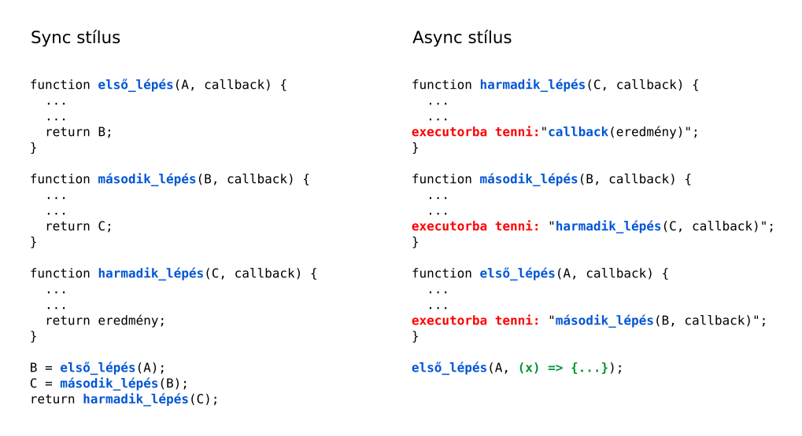
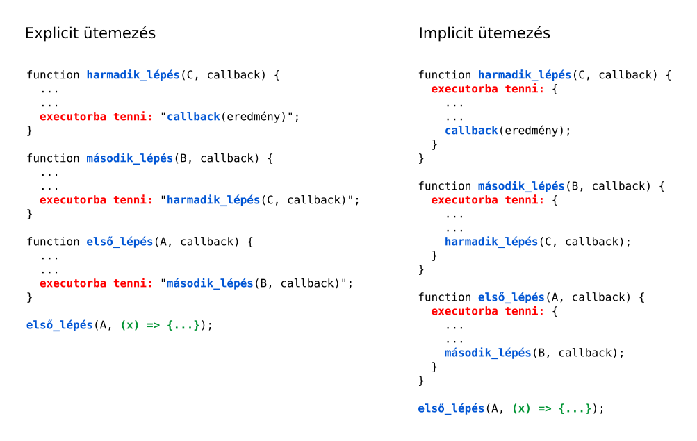
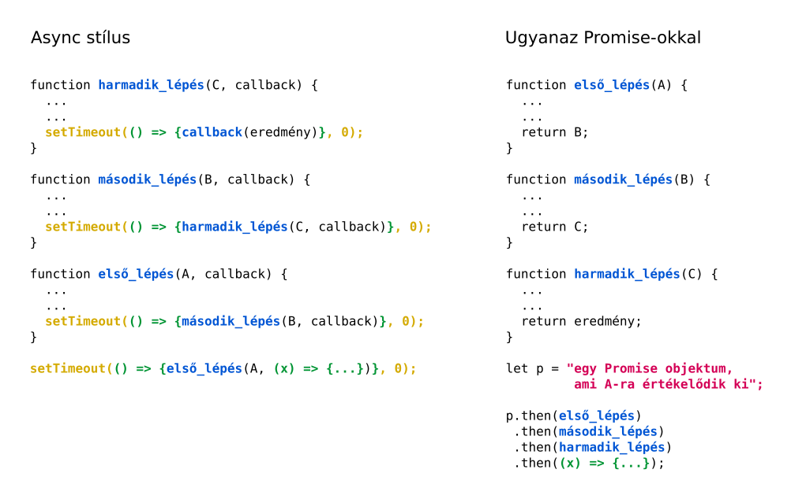

# Promise-ok

Egy egyszálas rendszerben amíg egy függvény fut, addig más függvények várnak.

Egy-egy hosszabban futó művelet közben szükség lehet arra, hogy a programunk
odafigyelhessen más dolgokra is, például kezelje a felhasználó
billentyűleütéseit, vagy státuszt írogasson másodpercenként.

Egy sokat használt megoldás, hogy a programot egy "executor" használatával írjuk
meg. Az executor lehet egy library amit a programunkhoz szerkesztünk, vagy akár
megírhatjuk mi magunk, de lehet beépítve a programunkat futtató virtuális gépbe
is.

Az executor maga nem más, mint egy lista amibe feladatokat lehet betenni, és egy
végtelen ciklus ami a listában levő feladatokat elindítja. Ezek a "feladatok"
Javascriptben lehetnek például függvény referenciák.

Egy program akkor fog szépen viselkedni, ha egy-egy feladat csak nagyon rövid
ideig fut. Nagy feladatokat szét szokás bontani sok kis részfeladatra, és azokat
külön-külün tenni az executorba. (Ez persze csak akkor számít, ha a
párhuzamosság látszatára szükség van. Például böngészőben futó kódnál és
webszerver kódnál mindig.)



Az "executorba tenni" művelet hatása, hogy a függvény nem vár, azonnal
visszatér, és majd amikor az executor oda jut hogy lefuttassa a dolgot, akkor
meghívódik a callback, és onnan lehet tudni, hogy készen van a dolog.

Megjegyzés: Callback-es megoldást "visszaalakítani" szinkron megoldássá nem
lehet. Nem lehet várni amíg egy callback lefut. Nyilván, hiszen ahhoz vagy
többszálas környezet kellene, vagy pedig az executornak képesnek kellene lennie
egy függvényt futás közben "megjegyezni", és később folytatni. Ezért egy async
függvény hatását már csak callback-ekben élvezhetjük. 

Az librarykből jövő async függvények jellemzően maguk tartalmazzák az
"executorba tevés" lépését, és nem kell nekünk magunknak gondoskodni erről.
Például a NodeJS `fs.readFile(path, callback)` függvényét ha meghívjuk, akkor az
rögtön visszatér, és majd ha kész a fájl olvasása, akkor az executor-ba teszi a
callback-et.

Az explicit és az implicit ütemezés teljesen ugyanazt a futási eredményt
adják, csak stílus kérdése a dolog. Lehet akár kombinálva is a kettő, ha például
explicit ütemezéssel írjuk a kódunkat, de közben használunk async NodeJS API
függvényeket, amelyek implicitek.



Javascriptben maga a nyelv végrehajtója egy ilyen executor. Egy `feladat` nevű
függvényt a
```javascript
setTimeout(feladat, 0);
```
hívással tudunk a Javascript executorába betenni.

A minta tehát a következő: kisebb programrészleteink vannak, amelyek gyorsan
lefutnak, a teljes feladat kis részét hajtják végre, majd ütemezik a következő
feladatot (beteszik az executor listájába). A callback-et nem maguk hívják meg,
hanem továbbadják, hogy aztán a lánc végén levő végül meghívhassa.

A Promise épp ezt csinálja: elég csak megírni magukat a függvényeket, és
megmondani egy Promise példánynak, mit csináljon, és mi legyen, ha kész van vele.



A `.then` mindig egy újabb Promise-t ad vissza, ezért láncolhatjuk, ahogy a
fenti kód is mutatja.

## 1. Feladat - írjunk egy egyszerű promise osztályt

A Javascript-ben az ES6 óta alapból elérhető Promise képességeinek csak egy kis részét implementáljuk, az alábbiak szerint:

1. A konstruktornak egy paramétere van, mégpedig egy függvény, amit azonnal
   ütemez is. Használjuk a `setTimeout(..., 0)`-át ütemezéshez.
   ```javascript
   class SimplePromise {
       constructor(f) {
            ...  // Ide jönnek adattagok, amik a SimplePromise
                 // állapotát írják le.

            const execute = ...;  // Az execute-ot nekünk kell majd megírni.
                                  // Ez egy függvény lesz, ami az f-et hívja,
                                  // megfelelő paraméterekkel, lásd lejjebb.
            setTimeout(execute, 0);
       }
   }
   ```
   Emlékeztetőül, helyben függvényeket a `(paraméterek) => { kód }` szintaktikával
   tudunk írni, tehát valahogy így néz majd ki a dolog:
   ```javascript
   const execute = () => {
       f(valamilyen paraméterek);
   };
   ```
2. A konstruktor olyan `f` függvényt vár, amelynek két paramétere van:
   `f(resolve, reject)`.
   
   A konstruktor úgy ütemezi ezt a függvényt, hogy a `resolve` és a `reject`
   paramétereknek egy-egy saját maga gyártotta függvényt ad át. Elvárja, hogy az
   `f` a futása végén a kettő közül az egyiket meghívja. Sikeres futás esetén a
   `resolve`-ot, bármilyen hiba esetén a `reject`-et.
   ```javascript
   class SimplePromise {
       constructor(f) {
            this.done = false;  // Ide jönnek adattagok, amik a SimplePromise
            ...                 // állapotát írják le.

            const resolve = ...; // Egy függvény, meg kell írnunk, ez
                                 // hívódik majd, ha kész az "f". Paraméterként
                                 // az "f" eredményét kapja.

            const reject = ...; // Hasonló, ezt akkor hívja az "f",
                                // ha hibát akar jelezni. Paraméterben 
                                // megadja a hibát.

            const execute = () => {
              f(ide jön a resolve és a reject);    
            }

            setTimeout(execute, 0);
       }
   }
   ```
3. Az `SimplePromise` osztálynak ínunk kell egy `.then` metódust. Ez egy
   paramétert vár el, egy callback-et. Ellentétben a konstruktorral, a `.then`
   egy "sima" függvényt kér, nem `resolve/reject`-eset.
   
   A `.then` metódus készít egy új `SimplePromise`-t. A konstruktorába egy olyan
   függvényt ad, amelyik a fenti `resolve/reject` módszerrel működik: lefuttatja
   az `.then` callback-jét, és utána meghívja vagy a `resolve`-ot vagy a
   `reject`-et.
   
   Ha a bennfoglaló promise feladata már készen van, akkor a `.then` rögtön
   lefuttatja a callback-jét, ha nincs még, akkor a `.then` csak bejegyzi a
   bennfoglaló promise-ba, hogy mit kell majd futtatni, ha készen van a
   konstruktorban kapott feladattal.
   ```javascript
   const SimplePromise {
       constructor(f) {
           this.done = false;
           this.failed = false;
           this.next = null;
           ...
       }

       then(callback) {
           return new SimplePromise((resolve, reject) => {
               const doit = () => {
                   // Itt jön a callback meghívása, majd aszerint,
                   // hogy sikeresen lefutott-e, vagy exception-t dobott,
                   // meg kell hívni vagy a resolve-ot, vagy a reject-et.
               };
               if (!this.done) {
                    // Itt el kell tárolnunk a doit-et, mondjuk a this.next-be.
                    return;
               }
               doit();
           });
       }
   }
   ```
   A `return new SimplePromise((resolve, reject) => {...});` elsőre nehezen
   olvasható. Átírhatjuk így:
   ```javascript
   const SimplePromise {
       ...

       then(callback) {
           const vegrehajto = (resolve, reject) => {
               ...
           }
           return new SimplePromise(vegrehajto);
       }
   }
   ```
   Vegyük észre, hogy a `.then` definíciójában a `resolve` és a `reject` csak
   paraméterek, amiket használhatunk, nem pedig dolgok, amiket nekünk kell
   előállítanunk. A `SimplePromise` konstruktora elkészíti őket, és beadja a
   végrehajtó függvényünknek.

### A keret

A programunk teszteléséhez használjuk az alábbi egyszerű kódot:

```javascript
process = require('process');
...

class SimplePromise {
    ...
}

function addOne(x) {
    return x + 1;
}

function double(x) {
    return x * 2;
}

function printTheResult(x) {
    console.log(x);
}

const p = new SimplePromise((resolve, reject) => {
    resolve(parseInt(process.argv[2]));
    return;
})

p.then(addOne)
 .then(double)
 .then(printTheResult);
```

Ezt `node simple-promise.js 20` paranccsal futtatva épp 42-t kell hogy kapjunk
a kimeneten.

### Segítségek

A feladat nagyon nehéz, azért ne szégyelljünk néhány segítséget is igénybe venni.

#### Mit csináljon a resolve és a reject?

A `resolve` egyszerű: állítsa be az állapotváltozókat, azaz hogy készen van a
feladat, és hogy mi lett az eredménye. Ezután nézze meg, hogy van-e már `next`,
ha igen, hívja meg:
```javascript
const resolve = (result) => {
    this.result = result;
    this.done = true;
    if (this.next) {
        this.next();
    }
}
```

A `reject` nagyon hasonló, kap egy `error`-t, azt eltárolja. A `resolve`-hoz
képest még annyit tesz, hogy beállíta a `this.failed`-et is `true`-ra, majd ez
is meghívja a következő teendőt, ha van.

### Mit csináljon a `doit`?

A `doit` csak olyankor hívódik meg, ha a `promise` fő feladata, az `f` végrehajtása
már befejeződött, és az `f` meghívta vagy a `resolve`-ját, vagy a `reject`-jét.
Ezért amikor a `doit` futni kezd, akkor már meg tudjuk vizsgálni a `this.failed`-et.

Ha a `this.failed` igaz értékű, akkor a `doit` nem hajthatja végre a callback-jét,
meg kell viszont hívnia a saját `reject`-jét:

```javascript
then(callback) {
    return new SimplePromise((resolve, reject) => {
        const doit = () => {
            if (this.failed) {
                reject(this.valami, amit a konstruktorbeli reject eltárolt);
                return;
            }
            try {
                const result = f(itt be kell adnunk neki a saját result-unkat);
                resolve(result);
            } catch (e) {
                console.error(e);
                reject(e);
            }
        };
        ...
    });
}
```

A programnak nincsen szüksége `npm init`-re, egy sima `.js` fájlként elmentve
működnie kell, a `node simple-promise.js 20` paranccsal futtathatjuk.

([☞ megoldás](005-promises/megoldas-01))

### Mit tud még a gyári Promise?

A `SimplePromise` osztály jó arra, hogy megértsük az alapkoncepciót, de a gyári
`Promise` osztály sokkal jobb. Érdemes belenézni a dokumentációba az
[MDN](https://developer.mozilla.org/en-US/docs/Web/JavaScript/Reference/Global_Objects/Promise)-en.
Alább néhány különbség:

#### A `.then`-nel hívott függvények térhetnek vissza Promise-szal.

A `SimplePromise` osztály `.then` metódusát úgy írtuk meg, hogy miután
lefuttatta a callback-et, mindenképp annak az eredményét adta tovább a
következőnek a láncban. A gyári `Promise` ezzel szemben figyeli, hogy a callback
egy `Promise`-t ad-e vissza. Ebben az esetben ezt a `Promise`-t befűzi a láncba.

Ez nagyon hasznos, mert néha nem szinkron függvényeket is be kell illesztenünk a
`.then` láncba.

#### `.all` és `.race`.

A gyári `Promise`-nak meg tudjuk adni `Promise`-ok egy listáját, és kérni tőle, hogy akkor rezolválódjon,
* ha a lista összes eleme rezolválódott (`.all`), vagy
* ha legalább egy a listából rezolválódott (`.race`).

#### `Promise.resolve` és `Promise.reject`

A gyári `Promise`-nak vannak statikus metódusai, amelyekkel egy olyan `Promise`-t tudunk készíteni, amelyik biztosan, azonnal rezolválódik vagy reject-elődik, mégpedig az általunk megadott értékkel illetve hibával.

Tehát az alábbi kódot:

```javascript
const p = new Promise((resolve, reject) => {resolve(A)});
```

írhatjuk egyszerűen így:

```javascript
const p = Promise.resolve(A);
```

Hasonlóan megy a dolog a `reject`-tel.

#### A `.then`-nek két paramétere is lehet.

A gyári promise `.then` metódusa két függvény-referenciát is fogad
paraméterként. Az első mindig akkor futtatódik le, ha a promise sikeres
volt. A második akkor, ha reject-elődöt. Látunk is ilyet néha éles kódban:

```javascript
.then(
    (data) => {
        ...
    },
    (reason) => {
        console.error("Hiba: ", reason);
    })
```

Fontos: ha van a `.then`-nek hibakezelő függvény is megadva, és az nem dob
exceptiont, akkor a rendszer úgy gondolja, hogy a hiba le van kezelve, és
folytatja a promise-lánc végrehajtását.

#### Hibakezelés: `.catch`

Hasonló a `.then`-hez, de csak reject-elődött esetben hajtódik végre. Egy
syntactic sugar, a `.catch(hibakezelő)` ugyanazt jelenti, mint a
`.then(undefined, hibakezelő)`.

## 2. Feladat - írjuk meg a titkosítót Promise-okkal

Írjuk meg promise-okkal az előző fejezetekben megismert titkosító programot.
Használjuk a gyári `Promise` osztályt. Nagyjából így kell majd kinéznie:

```javascript
const fs = require('fs');
const process = require('process');

function writeTheFile(data) {
    // A "data" egy Buffer, amelyben a teljes kiírandó tartalom van.
    // Ez a függvény kétféle lehet: vagy szinkron módon kiírja a
    // tartalmat, vagy pedig készít egy Promise-t, amelyik majd
    // kiírja a tartalmat, és visszaadja ezt a Promise-t.
}

function xorTheData(data) {
    // Ezt megírhatjuk egyszerűbben, mint korábban. A data-ba várjunk
    // Buffer-t. A bájtok számát a data.length adja. A data[i] az i.
    // bájt karakterkódja - nem kell konvertálgatnunk. A data[i] írható
    // is egyben, azaz kiovassuk, xor-olunk, és visszaírjuk.
    // A függvény adja vissza ugyanazt a Buffert (csak a már módosított
    // tartalommal.)
}

function readTheFile(fileName) {
    // Ez adjon vissza egy Promise-t. A Promise végrehajtófüggvénye
    // használja az fs.readFile async függvényt. Az async függvény
    // callback-je hiba esetén reject-elje a promise-t, siker esetén
    // resolve-olja, mégpedig a fájl tartalmával.
}

readTheFile()
    .then(xorTheData)
    .then(writeTheFile);
```
([☞ megoldás](005-promises/megoldas-02))

## 3. Feladat - a (majdnem) teljes Promise API kipróbálása

Írjunk egy programot, ami a `Gulp`-hoz hasonlóan feldolgoz fájlokat egy
könyvtárban, mondjuk titkosítja őket, és kimenti őket egy `.titkos`
kiterjesztéssel az eredeti fájlok mellé.

A programot így lehessen használni:

```bash
node titkosit-mindet.js a.txt b.txt c.txt
```

Az eremény az `a.txt.titkos`, `b.txt.titkos`, ... fájlok létrejötte.

Ha futás közben hiba történik, akkor a program írjon hibaüzenetet.

A program váza:

```javascript
const fs = require('fs');
const process = require('process');

class File {
    constructor(fileName, content) {
        this.fileName = fileName;
        this.content = content;
    }
}

function readOneFile(fileName) {
  // Ez adjon vissza egy promise-t, ami egy File példányra rezolválódik.
}

function encodeOneFile(file) {
    const data = file.content;
    for (let i = 1; i < data.length; i++) {
        if (data[i] > 65 && data[i] < 122) {
            data[i] = ((data[i] - 65) + 1) % 57 + 65;
        }
    }
}

function encode(files) {
    const ps = [];
    for (const f of files) {
        // A ps-be push-oljunk egy-egy promise-t minden f-hez.
        // A promise futtassa az encodeOneFile-t, és rezolválódjon
        // magára az f-re.
    }
    return Promise.all(ps);
}

function writeOneFile(file) {
    const opts = {
        encoding: 'binary',
    };
    // Adjunk vissza egy új Promise-t, ami az fs.writeFile-t használja
    // a titkos fájl kiírásához.
}

function write(files) {
    const ps = [];
    for (const f of files) {
        ps.push(writeOneFile(f));
    }
    return Promise.all(ps);    
}

const filePromises = [];
for (let i = 2; i < process.argv.length; i++) {
    filePromises.push(readOneFile(process.argv[i]));
}

// Használjuk a Promise.all-t a filePromises végrehajtásához,
// majd .then-ekkel hívjuk an encode-ot és a write-ot. Végül
// egy .catch-ben írjuk ki a hibaüzenetet, ha bármi hiba történt.
```

([☞ megoldás](005-promises/megoldas-03))

## Async/await

A modern Javascriptben van egy speciális szintaktika, amivel a `Promise`-ok
funkcionalitásának egy része nagyon szépen elérhető.

```javascript
async function printHello() {
    console.log('Hello');
    return 42;
}

printHello().then(console.log);
```

Ha egy függvény deklarációja elé beírjuk, hogy `async`, akkor a deklaráció
eredménye egy speciális függvénytípus (`AsyncFunction`). Ezt lefuttatva az
eredmény egy `Promise`, ami majd a függvény visszatérési értékére rezolválódik.

Async függvények törzsében tudunk várakozni is, mégpedig az `await` primitívvel:

```javascript
async function printBoth() {
    const x = await printHello();
    console.log(x);
    return 'mindkettőt kiírtam'
}

printBoth().then(console.log);
```

Működik a függvénydefiníció minden szintaxisával, például így is:

```javascript
const printSomething = async (v) => {console.log(v)};

printSomething('something');
```

Amit nem lehet: `async` függvényen kívül `await`-elni. A legkülső `async`
függvényt csak útjára bocsátani tudjuk, valamint `.then`-nel illetve
`.catch`-csel kezelni az eredményét.

Nem lehet továbbá a `Promise.all` funkcionalitást `await`-tel megvalósítani, az
`await` mindenképp egy `Promise`-re vár csak.

```javascript

async function a() {...}
async function b() {...}

const promises = [a(), b()];
Promise.all(promises).then(...);
```

Vegyük észre, hogy `a()`, és nem `a` szerepel a `promises` tömbben, hiszen egy
`async` függvényt meg kell hívnunk ahhoz, hogy egy `Promise`-t kapjunk.

## 4. Feladat - Async/Await

Írjuk át az alábbi kódot az `async` és az `await` használatával. A végső `.then` persze marad `.then`, mert az a főprogramban van.

```javascript
function a() {
    return 42;
}

function b(x) {
    return 2 * x;
}

function c() {
    return Promise.resolve().then(a).then(b);
}

c().then(console.log);
```

([☞ megoldás](005-promises/megoldas-04))

## Promise-ok Typescript-ben.

A `Promise`-ok Typescript-ben egyszerűen csak működnek. Azaz ha nem akarjuk
specifikálni a típust, akkor tényleg semmit nem kell tennünk:

```typescript
const a = new Promise(...);
```

Ha akarjuk, akkor a `Promise<T>` generikus típust kell használnunk, ahol `T` az a típus, amire az adott `Promise` rezolválódik majd.

Tanulságos gyakorlat megnézni a Typescript library-jében, hogy hogyan definiálja
a `Promise` típust. Ehhez egyszerűen nyissunk egy könyvtárat, abban `npm init`,
és `npm install typescript --save-dev`. Ezután a `node_modules/typescript`
könyvtárban kezdhetünk keresgélni. A 

```bash
grep -r Promise . | less
```
kicsit ugyan
vadnak tűnik, de eredményes, eléggé az elején találjuk a `lib/lib.d.ts` fájlt,
ami eléggé jól hangzik. (Windowson a fenti `grep`-nek megfelelő parancs:
```
Get-ChildItem . -Recurse | Select-String -pattern "Promise" | Out-Host -paging
```

Valóban, abba belenézve ezt találjuk:

```typescript
/**
 * Represents the completion of an asynchronous operation
 */
interface Promise<T> {
    /**
     * Attaches callbacks for the resolution and/or rejection of the Promise.
     * @param onfulfilled The callback to execute when the Promise is resolved.
     * @param onrejected The callback to execute when the Promise is rejected.
     * @returns A Promise for the completion of which ever callback is executed.
     */
    then<TResult1 = T, TResult2 = never>(onfulfilled?: ((value: T) => TResult1 | PromiseLike<TResult1>) | undefined | null, onrejected?: ((reason: any) => TResult2 | PromiseLike<TResult2>) | undefined | null) : Promise<TResult1 | TResult2>;

    /**
     * Attaches a callback for only the rejection of the Promise.
     * @param onrejected The callback to execute when the Promise is rejected.
     * @returns A Promise for the completion of the callback.
     */
    catch<TResult = never>(onrejected?: ((reason: any) => TResult | PromiseLike<TResult>) | undefined | null): Promise<T | TResult>;
}
```

Azon kívül, hogy a Typescript ismeri a `Promise<T>` típust, másra nem nagyon van
szükségünk, soha nem fordul elő, hogy egy `.then` metódust szeretnénk letárolni
egy változóba, vagy átadni paraméterként.
